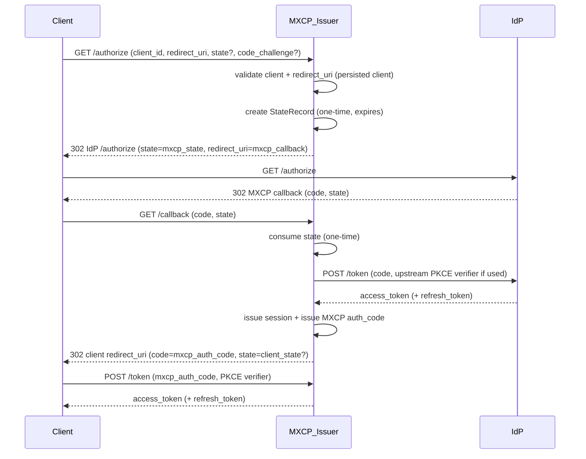

## Goals of this guide

This guide is for contributors who need to **maintain or extend MXCP authentication**.

It focuses on:
- **Architecture**: which components own which responsibilities
- **Security invariants**: what must not change without careful review
- **Extension points**: how to add a provider or a storage backend safely
- **Debugging**: how to diagnose common failure modes quickly

## Quick step-by-step OAuth flow

These are the calls involved in the OAuth flow:
* `/register`: the client registers itself with a `client_id` in an IdP. It's optional since the client can be pre-registered in the IdP, and configured in the client. (For example our MXCP server config implies we've registered it as an app in the IdP.)
* `/authorize`: the client initiates the flow. That call contains its `client_id`, a `redirect_uri` and optionally a `state` and a `code_challenge` if using PKCE.
  - `state` is eventually returned by the IdP as it redirects the browser to `redirect_uri`. The `state` lets the client confirm the data belongs to the correct request
  - For PKCE, the client generates a random `code_verifier` and derives a `code_challenge` from it. The IdP stores the challenge and later verifies it when the client sends the `code_verifier` at `/token`, proving possession of the original verifier.
  The IdP redirects the browser to the client's `redirect_uri` with a `code`
  (nothing to do with `code_challenge`) that is meant to be exchanged for the final access token by `/token`.
* `/token` is called with the authorization code (the `code` returned by the redirection that occurred during `/authorize`). The client also sends the `code_verifier` if using PKCE, which is used by the IdP to validate the call against the initial `code_challenge`. It then returns the access token.

## MXCP issuer implementation

1. When the client registers dynamically (DCR, Dynamic Client Registration), it calls `/register` and sends a `client_id` it generated along with a list of its `redirect_uris`. That step binds the client (identified by `client_id`) to allowed redirect URIs.
  * During the flow, a single `redirect_uri` is used. It's chosen by the client when it calls `/authorize` and has to match one of the registered URIs. It is where the MXCP server will eventually send the MXCP _authorization code_ (`auth_code`). That authorization code is eventually turned into the MXCP access token (the one appearing in the HTTP Authorization header in the end), by a call to `/token`. 
2. The client calls `/authorize` with its `client_id` and a `redirect_uri`. MXCP validates `redirect_uri` against the stored client record. From then on,
the goal of MXCP is to redirect the client's browser to the IdP's `/authorize`.
  * The `/authorize` step optionally involves a safety check using a _state_. The MCP client can add a `state` to its `/authorize` call. That state is eventually returned to the client who can use it to verify the message belongs to the particular request it initiated. It is a string it generates. MXCP stores it as `client_state`, and eventually returns it to the client like the protocol expects.
  * MXCP itself generates a `state`, another OAuth `state` string but for the MXCP/IdP side. It's stored as `state` in the code. That state is one-time and
  consumed on callback (see below).
  * In a regular OAuth flow involving a client and an IdP, the client communicates its `redirect_uri` to the IdP. The IdP eventually redirects the browser to that `redirect_uri`, passing the client's `state` and the IdP's generated `code`.
  * `code` is an IdP-generated short-lived code that can eventually be exchanged
  for an access token.
  * With MXCP in the picture, the client's call to MXCP's `/authorize` instead redirects the browser to the IdP's `/authorize`, but with MXCP's details (its `client_id`, its `state`, its `code_challenge` if the IdP supports PKCE, and with its _MXCP_ `callback_url`, the one configured with the `callback_path` config knob). Meaning the IdP's answer to the `/authorize` redirects the user's browser to the MXCP callback, with the MXCP supplied `state` and the IdP's `code`.
3. Upon getting its own callback called, MXCP will redirect the browser to the
   original client's callback:
   1. Validates the `state` (its own, now sent by the IdP). It consumes it and deletes it.
   2. Calls the IdP to exchange the `code` for an access token using the IdP's `/token` call.
   3. Fetches user info from the provider.
   4. Issues and persists an MXCP session (it contains the MXCP `access_token`, and the IdP's refresh and access tokens).
   5. Creates and persist an MXCP `auth_code`, which is meant to play the role of the OAuth `code` sent to the MCP client.
   6. Redirects the browser to the client's `redirect_uri` with the `code` (`auth_code`) and the original client's `state` (`client_state`).
4. The client's callback is called with the client's original `state` (if it was present) and MXCP's `code`.
  * The client calls MXCP's `/token` with MXCP's auth code, but also its `client_id` and `redirect_uri` (they're used to validate the call on the
  server/MXCP side). MXCP returns the `access_token` it generated earlier, and a `refresh_token`.

## Mental model

MXCP runs OAuth in **issuer-mode**:
- **MCP clients authenticate to MXCP** using OAuth.
- **MXCP can authenticate users against an upstream IdP** (Google/Atlassian today via `ProviderAdapter`).

The key idea is that **the IdP callback always returns to MXCP**, and then **MXCP redirects to the MCP client**.

### Core components (new stack)

- **Contracts**: `mxcp.sdk.auth.contracts`
  - Defines `ProviderAdapter`, `GrantResult`, `UserInfo`, `ProviderError`.
- **Orchestration**: `mxcp.sdk.auth.auth_service.AuthService`
  - Drives `/authorize` → callback → code issuance → token exchange.
- **Lifecycle**: `mxcp.sdk.auth.session_manager.SessionManager`
  - Creates/consumes state, issues sessions, creates auth codes.
- **Persistence**: `mxcp.sdk.auth.storage.TokenStore` + `SqliteTokenStore`
  - Source of truth for expiry + one-time use semantics and persistence across restarts.
- **Server bridge**: `mxcp.server.core.auth.issuer_provider.IssuerOAuthAuthorizationServer`
  - Adapts MXCP’s auth stack to the MCP OAuth provider interface.
- **Request auth**: `mxcp.sdk.auth.middleware.AuthenticationMiddleware`
  - Loads sessions by access token and sets user context.

### Legacy stack

The legacy handler-based stack has been removed. Only the ProviderAdapter-based issuer-mode stack is supported.

## OAuth flows (issuer-mode)

### 1) /authorize (client → MXCP)

- Input: `client_id`, `redirect_uri`, optional `state`, optional `code_challenge`.
- MXCP validates the client and redirect URI against **persisted** client registration.
- MXCP creates a **StateRecord** (one-time, expiring) to bind:
  - client_id
  - client redirect_uri
  - downstream PKCE fields (client ↔ MXCP)
  - upstream PKCE verifier (MXCP ↔ IdP), if used
  - the original client `state` (returned back to the client)
- MXCP redirects the browser to the IdP `/authorize`, using **MXCP callback URL**.

### 2) Callback (IdP → MXCP callback)

- Input: `code` and `state` (or `error` and `state`).
- MXCP consumes state (one-time) and exchanges provider code for provider tokens.
- MXCP issues:
  - an MXCP **session** (opaque MXCP access token + refresh token)
  - an MXCP **authorization code** bound to the session
- MXCP redirects the browser to the *client redirect_uri* with the MXCP auth code and the original client state.

### 3) /token exchange (client → MXCP)

- Input: MXCP auth code + (possibly) downstream PKCE verifier.
- Token endpoint verifies PKCE (per MCP framework) and then MXCP:
  - validates code binding (client_id / redirect_uri)
  - ensures one-time use of the auth code
  - returns MXCP access token (and refresh token)

### Sequence diagram

## Security invariants (“do not break”)

If you change code touching these rules, require a careful review.

- **State is one-time use**
  - State must be consumed (deleted) on first use.
  - Expired state must be rejected.
- **Auth codes are one-time use**
  - Auth codes must be deleted on redemption (when the `auth_code` is exchanged for an `access_token` during the call to `/token`).
  - Expired auth codes must be rejected.
- **Redirect URI binding is strict**
  - `redirect_uri` must be validated against persisted client registration.
  - Never redirect to a URI that wasn’t safely derived from stored state/client metadata.
- **Issuer-mode scopes policy**
  - OAuth client-requested scopes must **not** influence upstream IdP scopes.
  - Upstream IdP scopes come from server/provider configuration.
  - Client-supplied scopes may be stored as metadata (DCR or `/authorize`) but are not used for IdP authorization.
- **PKCE boundaries are explicit**
  - Downstream PKCE: client ↔ MXCP token endpoint.
  - Upstream PKCE: MXCP ↔ IdP token exchange (provider capability).
- **No sensitive logging**
  - Never log tokens, secrets, emails, or user identifiers.
  - Avoid logging raw exception messages if they may contain sensitive data.
- **Token persistence policy**
  - MXCP access tokens should be stored hashed.
  - Provider tokens should be encrypted at rest when persistence is enabled.

## Extension guide

### Add a new provider (IdP)

Implement `ProviderAdapter` under `mxcp.sdk.auth.providers`:
- Implement:
  - `build_authorize_url()`
  - `exchange_code()`
  - `refresh_token()`
  - `fetch_user_info()`
  - `revoke_token()`
- Raise `ProviderError(error, description, status_code)` for expected failures.
- Never log response bodies, tokens, secrets, or PII.

Tests to add:
- `tests/sdk/auth/test_<provider>_provider_adapter.py`
  - authorize URL parameter correctness
  - token error parsing (non-200, invalid JSON, OAuth error objects)
  - scope semantics (provider `scope` field optional)

### Add a new storage backend

Implement the `TokenStore` protocol:
- Enforce one-time state consumption and auth code one-time use.
- Honor TTL on reads and delete expired records.
- Ensure async safety (thread-safe if wrapping sync I/O).

Tests to add:
- extend `tests/sdk/auth/test_token_store.py` for backend parity.

### Changing middleware behavior

Before changing `AuthenticationMiddleware`, decide and document:
- Do we require IdP availability per request?
- Do we re-fetch userinfo on every request, or rely on stored session user info?

Then update tests in `tests/sdk/auth/test_middleware.py` to match the policy.

### Storage performance wrappers (read cache + write optimizer)

We keep the `TokenStore` single-op contract as the required API and add optional capabilities that wrappers can exploit.

- Read-cache wrapper (`CachingTokenStore`):
  - Wraps any `TokenStore`; keeps per-process in-memory caches for sessions, states, auth codes, and clients.
  - Read-through with TTL = min(record expiry, cap) minus a small skew; negative-cache misses briefly.
  - Invalidate on store/delete/consume; one `asyncio.Lock` to guard cache maps.
  - Optional metrics: hit/miss/invalidation counters (no tokens/PII).
- Write-optimizer wrapper (`BufferedTokenStore`):
  - Queues single-op writes; flush triggers: `max_batch_size` or `max_delay`.
  - Coalesce duplicate writes (keep last per key); reads bypass the buffer.
  - On flush: if the delegate exposes bulk hooks, use them; else run single-op calls inside one transaction/single worker to reduce lock/fsync churn.
  - Graceful shutdown: drain queue on `close`; retry or surface errors (no silent loss).
- Optional bulk capability (feature-detected):
  - Define an optional protocol (e.g., `BulkSessionStore`) with:
    - `bulk_store_sessions(records: list[StoredSession]) -> None`
    - `bulk_delete_sessions_by_hash(hashes: list[str]) -> None`
    - optionally `bulk_cleanup_expired() -> dict[str, int]`
  - Backends may implement these; wrappers check `isinstance(delegate, BulkSessionStore)` (or `hasattr`) and fall back when absent.
- SQLite backend updates:
  - Implement the bulk hooks using one transaction + `executemany` / `DELETE … WHERE access_token_hash IN (…)`.
  - Keep existing single-op methods as-is; bulk is an optimization only.
- Tests to add (make them backend-agnostic via parametrized fixtures):
  - Core `TokenStore` (keep existing): states/auth-codes one-time, expiry pruning, session load/store/delete by token/id/refresh, encryption/plaintext opt-in, cleanup.
  - Caching wrapper suite:
    - Hit/miss/negative-cache: first miss hits delegate, subsequent read hits cache; expired entries are evicted and not returned.
    - Invalidation: store/delete/consume paths evict relevant cache keys; no stale reads after writes/deletes/consumes.
    - TTL skew: cache TTL is slightly shorter than record expiry; ensure expired sessions/auth-codes/states are not served.
  - Buffered write wrapper suite:
    - Flush triggers: size threshold and time threshold both flush to delegate; after flush, data is persisted.
    - Coalescing: multiple writes to the same key before flush result in a single persisted value (last write wins).
    - Shutdown drain: `close()` drains the queue; no queued writes are lost.
    - Error propagation: delegate errors surface (or are retried once); no silent drops.
  - Bulk capability suite (run only if backend advertises bulk):
    - `bulk_store_sessions` / `bulk_delete_sessions_by_hash` persist/delete all items; results match looping single-op calls.
    - Fallback parity: when bulk is absent, wrapper falls back to single-op (ideally in one transaction) with identical outcomes.

### Standard DCR support (RFC 7591)

Today `register_client()` requires a client-supplied `client_id`. For standard DCR behavior, MXCP should mint a `client_id` (and optionally a client secret) when it is omitted, return it in the DCR response, and persist it. We can keep accepting client-supplied IDs for backward compatibility, but the server-generated path should be the default when `client_id` is missing.

### Recommended userinfo refresh policy

- Default: rely on `StoredSession.user_info` captured at login; do **not** call the provider on every request.
- Refresh userinfo only on clear signals:
  - After a successful provider token refresh (optional/flagged) to capture profile changes.
  - Optionally on a long interval (e.g., 12–24h) if you need profile freshness (name/avatar/email); keep off by default.
- Rationale: avoids hammering the IdP, reduces latency/coupling, and keeps MXCP usable during IdP degradation. Provider token validity is enforced when you actually use it; no per-request userinfo call is needed.

### Recommended provider token refresh policy (implement like this)

- Scope: This is for upstream provider tokens stored in the session (`provider_access_token`, `provider_refresh_token`, `provider_expires_at`). MXCP access/refresh tokens are handled by the MCP framework separately.
- Trigger: On demand, right before using `session.provider_access_token` in middleware or helpers. No background cron.
- Skew check: If `provider_expires_at` minus now < skew (e.g., 60–120s), or already expired, attempt a refresh if `provider_refresh_token` exists; otherwise require re-auth.
- Refresh call: `provider_adapter.refresh_token(refresh_token=provider_refresh_token, scopes=session.scopes)` (scopes optional per adapter). Treat `invalid_grant` or HTTP 400/401 as refresh failure.
- Rotation: Persist the returned provider access token, refresh token (if rotated), and new `provider_expires_at` atomically via `SessionManager`/`TokenStore`. If the provider returns the same refresh token, keep it; if it returns a new one, replace it.
- Refresh-token expiry: If the provider exposes `refresh_expires_in/at` (not currently stored), add support to track it. If it is near/past expiry, either attempt one final refresh (soft threshold) or require re-auth if past the hard cutoff.
- Userinfo: By default, do not re-fetch userinfo per request. Optionally fetch userinfo once immediately after a successful refresh (feature-flagged) to capture profile changes; otherwise continue using cached `session.user_info`.
- Failure handling: On refresh failure, mark the provider token unusable and require re-auth; avoid retry storms by applying a short backoff marker in the session.
- Tests to add in `tests/sdk/auth/test_middleware.py`:
  - Expired/near-expiry provider token triggers refresh and persists new tokens (and optionally new RT).
  - Refresh failure surfaces as auth failure/reauth; no tight retry loop.
  - Cached userinfo is used when refresh is not needed.
  - Optional userinfo-on-refresh path runs once when enabled.

### Current gaps / TODO (implementation status)

- Middleware today still re-fetches provider userinfo per request; the above refresh/userinfo policy is not yet implemented.
- Provider token refresh is not yet wired: add the expiry check + refresh path in `mxcp.sdk.auth.middleware.AuthenticationMiddleware`, and persist updates via `SessionManager`/`TokenStore`.
- When adding it, cover tests in `tests/sdk/auth/test_middleware.py` per the cases listed above.

## Debugging playbook

### Fast checks
- Run auth tests:
  - `uv run pytest tests/sdk/auth`
  - `uv run pytest tests/server/test_issuer_provider.py tests/server/test_oauth_callback_route.py`

### Common failures and likely causes
- **invalid_state**
  - state missing/expired/consumed; DB not persisted; callback path mismatch.
- **invalid_grant (auth code)**
  - code expired, already redeemed, client_id mismatch, redirect mismatch.
- **unauthorized_client / client not found**
  - client was not registered/persisted; DCR didn’t persist; wrong client_id.
- **redirect URI not registered**
  - client registration missing redirect; mismatch between configured and request URI.

### Where to look
- State handling: `mxcp.sdk.auth.session_manager.SessionManager` and `mxcp.sdk.auth.storage.TokenStore`
- Auth code redemption: `mxcp.sdk.auth.auth_service.AuthService.exchange_token`
- Server bridge validation: `mxcp.server.core.auth.issuer_provider.IssuerOAuthAuthorizationServer`
- Callback route behavior: `mxcp.server.interfaces.server.mcp.RAWMCP._register_oauth_routes`
