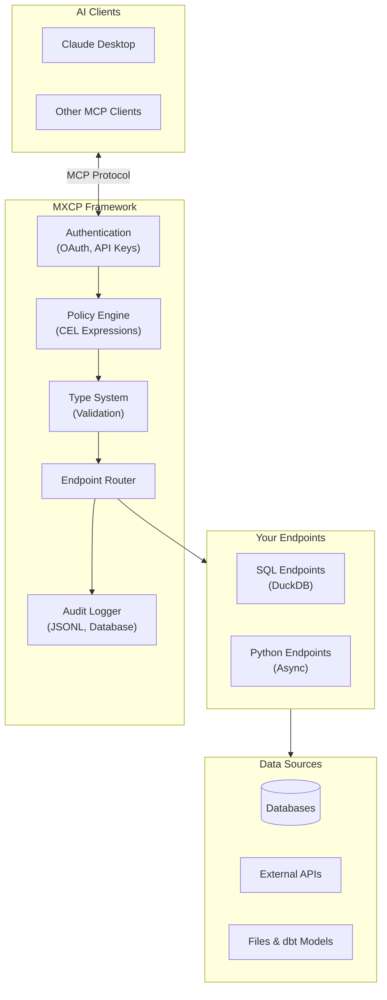
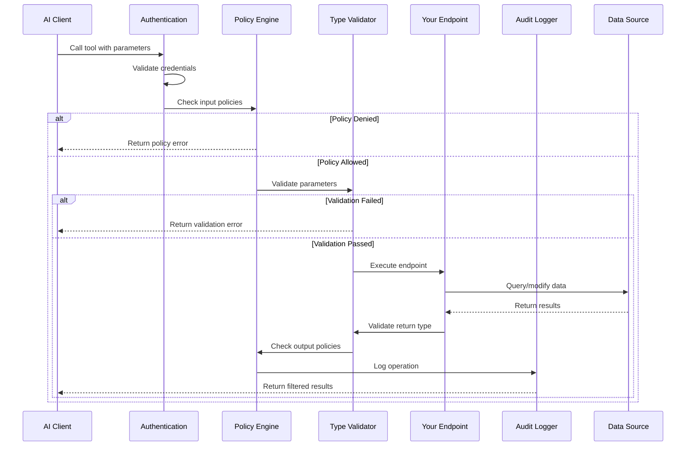
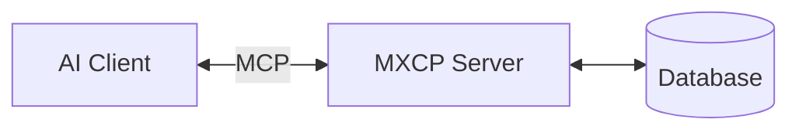
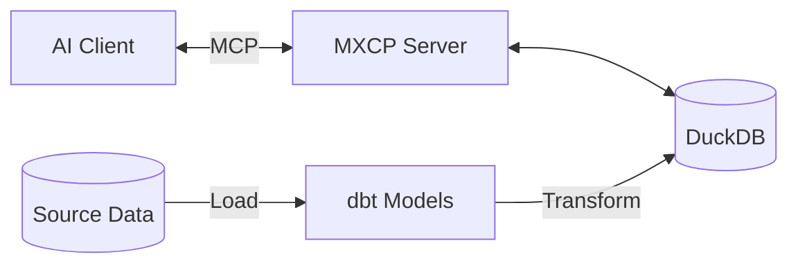
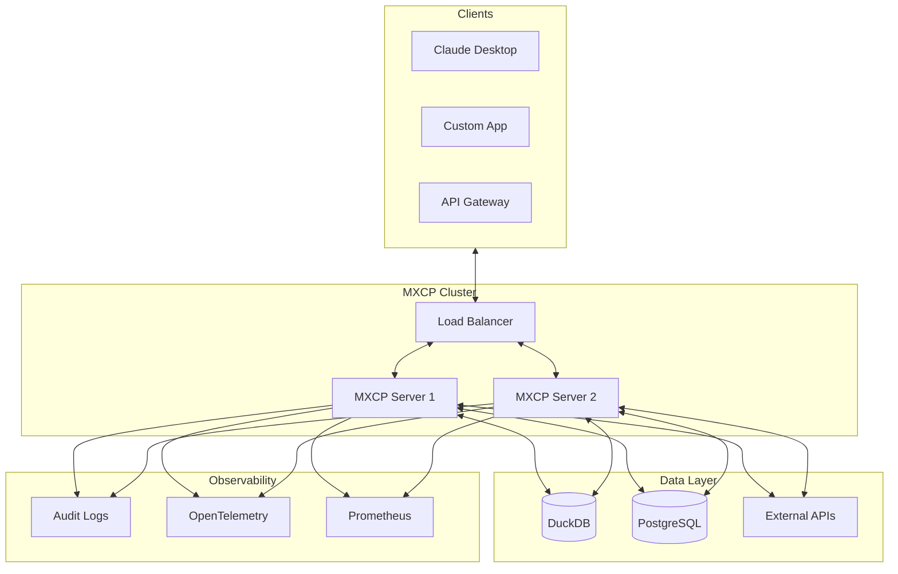

MXCP (Model Context Protocol eXtension Platform) is an enterprise-grade framework for building production-ready AI tools. It extends the [Model Context Protocol (MCP)](https://modelcontextprotocol.io/) with security, testing, and operational features required for real-world deployments.

## What is MCP?

The Model Context Protocol is an open standard that enables AI assistants like Claude to interact with external data sources and tools. MCP servers expose:

- **Tools** - Functions the AI can call (e.g., query a database, create a ticket)
- **Resources** - Data the AI can read (e.g., customer profiles, documents)
- **Prompts** - Reusable prompt templates with parameters

## What MXCP Adds

While MCP defines the protocol, MXCP provides the complete framework for building production systems:



### Security & Governance

- **Authentication** - OAuth providers (GitHub, Google, Atlassian, Salesforce, Keycloak) or API keys
- **Policy Enforcement** - Fine-grained access control using CEL expressions
- **Audit Logging** - Track every operation for compliance and debugging

### Developer Experience

- **SQL Endpoints** - Write tools using SQL with DuckDB's powerful analytical engine
- **Python Endpoints** - Build complex logic with async Python functions
- **Type Safety** - Comprehensive parameter and return type validation

### Quality Assurance

- **Validation** - Verify endpoints match their specifications
- **Testing** - Unit tests with assertions for results, errors, and policies
- **Linting** - Improve how AI models understand and use your tools
- **Evals** - Test AI behavior with your endpoints

### Operations

- **Drift Detection** - Monitor schema changes across environments
- **Hot Reload** - Update configuration without restarting
- **Observability** - OpenTelemetry integration for tracing and metrics

## How It Works

### 1. Define Your Project

Create a project configuration file:

```yaml
# mxcp-site.yml
mxcp: 1
project: my-project
profile: dev

database:
  path: "data/app.db"
```

### 2. Create Endpoints

Define tools using SQL or Python:

```yaml
# tools/search_users.yml
mxcp: 1
tool:
  name: search_users
  description: Search for users by name or email

  parameters:
    - name: query
      type: string
      description: Search term

  return:
    type: array
    items:
      type: object
      properties:
        id: { type: integer }
        name: { type: string }
        email: { type: string }

  source:
    code: |
      SELECT id, name, email
      FROM users
      WHERE name ILIKE '%' || $query || '%'
         OR email ILIKE '%' || $query || '%'
      LIMIT 10
```

### 3. Add Security

Protect sensitive operations with policies:

```yaml
# tools/delete_user.yml
mxcp: 1
tool:
  name: delete_user
  description: Delete a user account (admin only)

  parameters:
    - name: user_id
      type: integer

  policies:
    input:
      - condition: "user.role != 'admin'"
        action: deny
        message: "Only administrators can delete users"

  source:
    code: |
      DELETE FROM users WHERE id = $user_id
      RETURNING id, 'deleted' as status
```

### 4. Write Tests

Verify your endpoints work correctly:

```yaml
# In the same tool file
  tests:
    - name: admin_can_delete
      arguments:
        - key: user_id
          value: 123
      user_context:
        role: admin
      result_contains:
        status: "deleted"

    - name: non_admin_denied
      arguments:
        - key: user_id
          value: 123
      user_context:
        role: user
      expect_error: true
```

### 5. Run and Connect

Start the server and connect your AI client:

```bash
# Validate configuration
mxcp validate

# Run tests
mxcp test

# Start the server
mxcp serve
```

## Request Flow

Here's what happens when an AI calls one of your tools:



## Architecture Patterns

MXCP supports different architectural patterns depending on your needs:

### Simple: Single Server

For small projects or development:



### Production: With dbt

For data-driven applications:



### Enterprise: Full Stack

For large-scale deployments:



## Comparison with Other Approaches

| Feature | Plain MCP | MXCP |
|---------|-----------|------|
| Protocol Support | Yes | Yes |
| Authentication | Manual | Built-in OAuth |
| Authorization | Manual | CEL Policies |
| Audit Logging | No | Built-in |
| Type Validation | Basic | Comprehensive |
| Testing Framework | No | Built-in |
| SQL Endpoints | No | DuckDB |
| Python Endpoints | Manual | Integrated |
| Drift Detection | No | Built-in |
| Hot Reload | No | Built-in |

## Next Steps

Ready to get started?

1. **[Quickstart](quickstart)** - Get MXCP running in 5 minutes
2. **[Hello World Tutorial](/tutorials/hello-world)** - Build your first tool
3. **[Concepts](/concepts)** - Understand endpoints, types, and project structure
