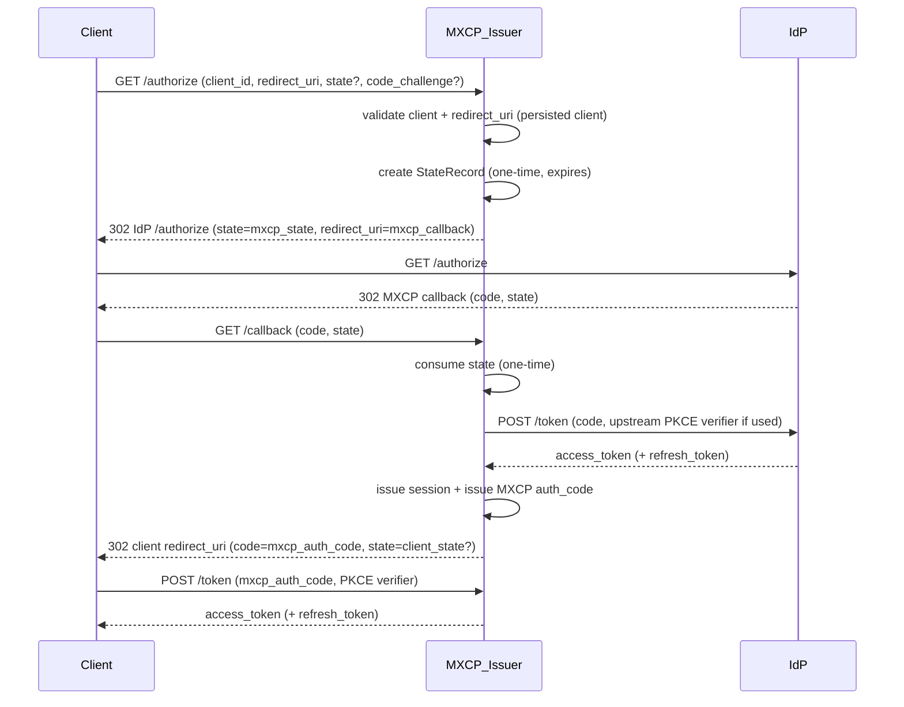

## Goals of this guide

This guide is for contributors who need to **maintain or extend MXCP authentication** without being OAuth specialists.

It focuses on:
- **Architecture**: which components own which responsibilities
- **Security invariants**: what must not change without careful review
- **Extension points**: how to add a provider or a storage backend safely
- **Debugging**: how to diagnose common failure modes quickly

It intentionally does **not** try to teach OAuth from scratch.

## Mental model

MXCP runs OAuth in **issuer-mode**:
- **MCP clients authenticate to MXCP** using OAuth.
- **MXCP can authenticate users against an upstream IdP** (Google/Atlassian today via `ProviderAdapter`).

The key idea is that **the IdP callback always returns to MXCP**, and then **MXCP redirects to the MCP client**.

### Core components (new stack)

- **Contracts**: `mxcp.sdk.auth.contracts`
  - Defines `ProviderAdapter`, `GrantResult`, `UserInfo`, `ProviderError`.
- **Orchestration**: `mxcp.sdk.auth.auth_service.AuthService`
  - Drives `/authorize` → callback → code issuance → token exchange.
- **Lifecycle**: `mxcp.sdk.auth.session_manager.SessionManager`
  - Creates/consumes state, issues sessions, creates auth codes.
- **Persistence**: `mxcp.sdk.auth.storage.TokenStore` + `SqliteTokenStore`
  - Source of truth for expiry + one-time use semantics and persistence across restarts.
- **Server bridge**: `mxcp.server.core.auth.issuer_provider.IssuerOAuthAuthorizationServer`
  - Adapts MXCP’s auth stack to the MCP OAuth provider interface.
- **Request auth**: `mxcp.sdk.auth.middleware.AuthenticationMiddleware`
  - Loads sessions by access token and sets user context.

### Legacy stack

The legacy handler-based stack has been removed. Only the ProviderAdapter-based issuer-mode stack is supported.

## OAuth flows (issuer-mode)

### 1) /authorize (client → MXCP)

- Input: `client_id`, `redirect_uri`, optional `state`, optional `code_challenge`.
- MXCP validates the client and redirect URI against **persisted** client registration.
- MXCP creates a **StateRecord** (one-time, expiring) to bind:
  - client_id
  - client redirect_uri
  - downstream PKCE fields (client ↔ MXCP)
  - upstream PKCE verifier (MXCP ↔ IdP), if used
  - the original client `state` (returned back to the client)
- MXCP redirects the browser to the IdP `/authorize`, using **MXCP callback URL**.

### 2) Callback (IdP → MXCP callback)

- Input: `code` and `state` (or `error` and `state`).
- MXCP consumes state (one-time) and exchanges provider code for provider tokens.
- MXCP issues:
  - an MXCP **session** (opaque MXCP access token + refresh token)
  - an MXCP **authorization code** bound to the session
- MXCP redirects the browser to the *client redirect_uri* with the MXCP auth code and the original client state.

### 3) /token exchange (client → MXCP)

- Input: MXCP auth code + (possibly) downstream PKCE verifier.
- Token endpoint verifies PKCE (per MCP framework) and then MXCP:
  - validates code binding (client_id / redirect_uri)
  - ensures one-time use of the auth code
  - returns MXCP access token (and refresh token)

### Sequence diagram

## Security invariants (“do not break”)

If you change code touching these rules, require a careful review.

- **State is one-time use**
  - State must be consumed (deleted) on first use.
  - Expired state must be rejected.
- **Auth codes are one-time use**
  - Auth codes must be deleted on redemption.
  - Expired auth codes must be rejected.
- **Redirect URI binding is strict**
  - `redirect_uri` must be validated against persisted client registration.
  - Never redirect to a URI that wasn’t safely derived from stored state/client metadata.
- **Issuer-mode scopes policy**
  - OAuth client-requested scopes must **not** influence upstream IdP scopes.
  - Upstream IdP scopes come from server/provider configuration.
  - When provider scope config is omitted or empty, MXCP requests no scopes upstream.
- **PKCE boundaries are explicit**
  - Downstream PKCE: client ↔ MXCP token endpoint.
  - Upstream PKCE: MXCP ↔ IdP token exchange (provider capability).
- **No sensitive logging**
  - Never log tokens, secrets, emails, or user identifiers.
  - Avoid logging raw exception messages if they may contain sensitive data.
- **Token persistence policy**
  - MXCP access tokens should be stored hashed.
  - Provider tokens should be encrypted at rest when persistence is enabled.

## Extension guide

### Add a new provider (IdP)

Implement `ProviderAdapter` under `mxcp.sdk.auth.providers`:
- Implement:
  - `build_authorize_url()`
  - `exchange_code()`
  - `refresh_token()`
  - `fetch_user_info()`
- Raise `ProviderError(error, description, status_code)` for expected failures.
- Never log response bodies, tokens, secrets, or PII.

Tests to add:
- `tests/sdk/auth/test_<provider>_provider_adapter.py`
  - authorize URL parameter correctness
  - token error parsing (non-200, invalid JSON, OAuth error objects)
  - scope semantics (omitted/empty provider scope → no scopes requested)

### Add a new storage backend

Implement the `TokenStore` protocol:
- Enforce one-time state consumption and auth code one-time use.
- Honor TTL on reads and delete expired records.
- Ensure async safety (thread-safe if wrapping sync I/O).

Tests to add:
- extend `tests/sdk/auth/test_token_store.py` for backend parity.

### Changing middleware behavior

Before changing `AuthenticationMiddleware`, decide and document:
- Do we require IdP availability per request?
- Do we re-fetch userinfo on every request, or rely on stored session user info?

Then update tests in `tests/sdk/auth/test_middleware.py` to match the policy.

## Debugging playbook

### Fast checks
- Run auth tests:
  - `uv run pytest tests/sdk/auth`
  - `uv run pytest tests/server/test_issuer_provider.py tests/server/test_oauth_callback_route.py`

### Common failures and likely causes
- **invalid_state**
  - state missing/expired/consumed; DB not persisted; callback path mismatch.
- **invalid_grant (auth code)**
  - code expired, already redeemed, client_id mismatch, redirect mismatch.
- **unauthorized_client / client not found**
  - client was not registered/persisted; DCR didn’t persist; wrong client_id.
- **redirect URI not registered**
  - client registration missing redirect; mismatch between configured and request URI.

### Where to look
- State handling: `mxcp.sdk.auth.session_manager.SessionManager` and `mxcp.sdk.auth.storage.TokenStore`
- Auth code redemption: `mxcp.sdk.auth.auth_service.AuthService.exchange_token`
- Server bridge validation: `mxcp.server.core.auth.issuer_provider.IssuerOAuthAuthorizationServer`
- Callback route behavior: `mxcp.server.interfaces.server.mcp.RAWMCP._register_oauth_routes`
